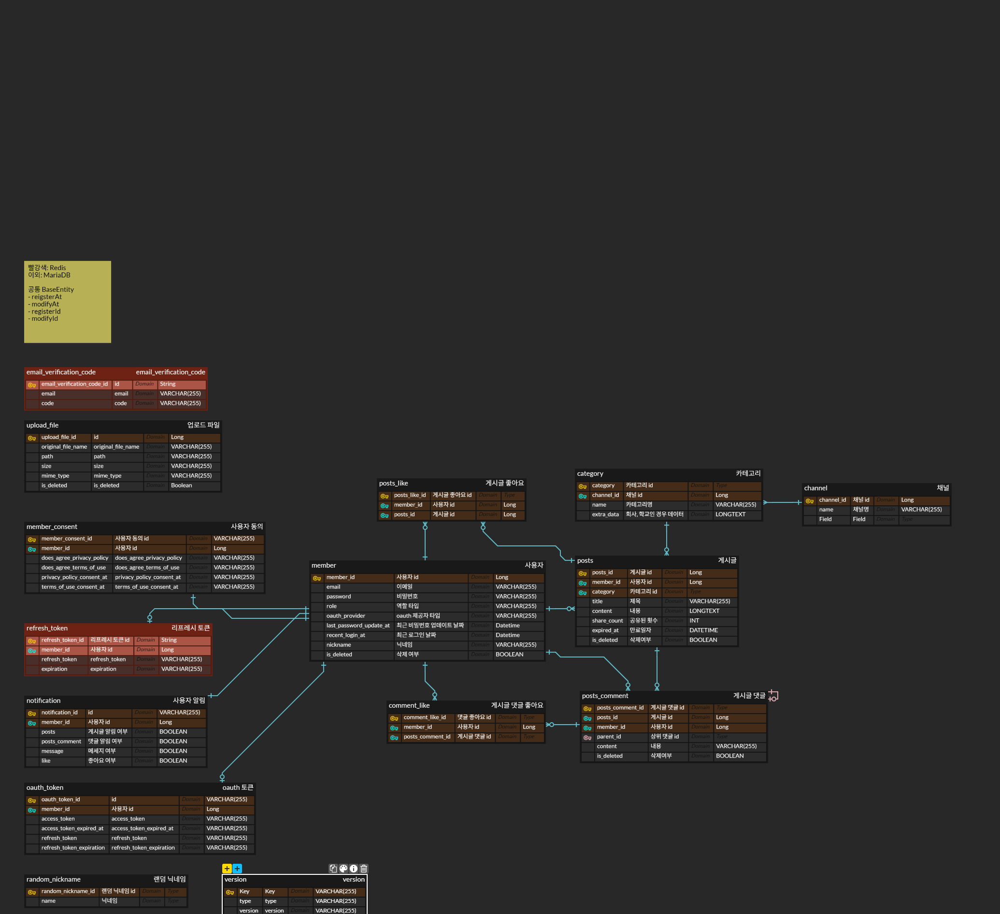

## 목차

- [개발 환경 구성하는 방법](https://github.com/IMPACUS/whispr-docs/blob/master/be/dev-environment.md)
- [그라운드 룰](https://github.com/IMPACUS/whispr-docs/blob/master/be/ground-rule.md)
- 프로젝트 구성 가이드
  - [Global Excetion Handler](https://github.com/IMPACUS/whispr-docs/blob/master/be/project-configration-guide/global-excetion-handler.md)
  - [DB 암호화 복호화 컨버터 (AES256ToStringConverter)](https://github.com/IMPACUS/whispr-docs/blob/master/be/project-configration-guide/aes-converter-util.md)
  - [APIResponseEntity 공통 응답 포맷](https://github.com/IMPACUS/whispr-docs/blob/master/be/project-configration-guide/api-response-entity.md)
  - [dev 서버 배포 정보](https://github.com/IMPACUS/whispr-docs/blob/master/be/deploy-dev.md)
  - [개발 기능 설계]()

## Backend Spec

- Java 17
- Springboot 3.4.5
- JPA
- DB: MariaDB

| 개발용 서버 | https://back-dev.whispr.krcol       |
| :---------- | ----------------------------------- |
| API docs    | https://back-dev.whispr.kr/api-docs |

## ERD

- https://www.erdcloud.com/d/LptHWKZxwmenRwFDc

## CICD 설정

- develop 브랜치에 commit: develop 서버 재배포
- 매월 1일마다: ssl 인증서 갱신
